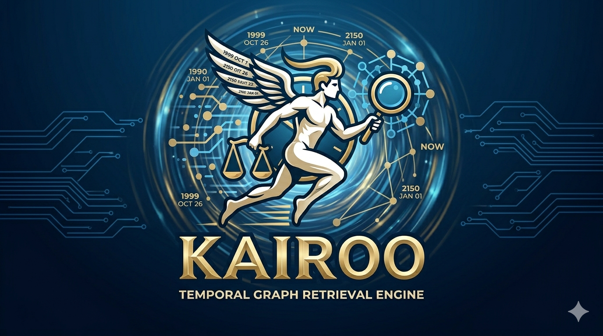

# Kairo



Kairo is a retrieval-native engine for building agentic systems over documents, structured databases, and evolving knowledge graphs. It plans retrieval before generation, reconstructs temporal or graph state when answers depend on time or topology, and returns evidence-grounded responses.

## Table of contents
- [What is Kairo](#what-is-kairo)
- [Installation](#installation)
- [Quickstart (CLI)](#quickstart-cli)
- [Quickstart (Python SDK)](#quickstart-python-sdk)
- [Data ingestion & RAG](#data-ingestion--rag)
- [Agents & multi-agent flows](#agents--multi-agent-flows)
- [Response structure](#response-structure)
- [Testing](#testing)

## What is Kairo
- **Retrieval-native**: plans how to retrieve (lexical, vector, graph, hybrid, temporal) before any generation.
- **Temporal + graph aware**: can reconstruct historical document or graph state when truth depends on time or topology.
- **Evidence grounded**: every answer is tied to ranked evidences and execution steps for transparency.

## Installation
Requires Python 3.9+.

```bash
pip install -e .

# (optional) dev tooling
pip install -e ".[dev]"
```

## Quickstart (CLI)
The Typer CLI entrypoint lives in [`cli.app`](src/kairo/cli.py:16). A lightweight local store is persisted to `.kairo_store.json`.

**Local mode**
```bash
# Install
pip install -e .

# Ingest sample docs
kairo ingest examples/sample.jsonl

# Query locally
kairo query "How does Kairo handle temporal reconstruction?" --mode local --top-k 3
```

**Hosted mode**
```bash
kairo query "Explain temporal reconstruction" \
  --mode hosted \
  --base-url https://your.api \
  --api-key YOUR_KEY \
  --top-k 3
```

## Quickstart (Python SDK)

### Local pipeline
[`local.LocalPipeline`](src/kairo/local.py:24) provides a minimal local RAG pipeline with persistence.

```python
from kairo.local import LocalPipeline
from kairo.models import Document, QueryRequest

pipeline = LocalPipeline(store_path=".kairo_store.json")

pipeline.ingest_documents([
    Document(id="note-1", text="Temporal graphs capture evolving states."),
    Document(id="note-2", text="Retrieval planning precedes generation."),
])

resp = pipeline.query(QueryRequest(query="How does Kairo answer over time?", top_k=3))
print(resp.answer)
for ev in resp.evidences:
    print(ev.document_id, ev.score)
```

### Hosted client
Use [`client.HostedClient`](src/kairo/client.py:10) against your deployed API.

```python
from kairo.client import HostedClient
from kairo.models import QueryRequest

client = HostedClient(base_url="https://your.api", api_key="YOUR_KEY")
resp = client.query(QueryRequest(query="Explain temporal reconstruction", top_k=3))
print(resp.answer)
client.close()
```

## Data ingestion & RAG
Ingestion helpers in [`ingest.py`](src/kairo/ingest.py:17) cover text, JSONL, CSV, Excel, PDF, DOCX, and audio metadata. The CLI command [`cli.ingest`](src/kairo/cli.py:19) routes to [`ingest.ingest_any`](src/kairo/ingest.py:86), which loads:
- Text via [`ingest.ingest_text_file`](src/kairo/ingest.py:17)
- JSONL via [`ingest.ingest_jsonl`](src/kairo/ingest.py:22)
- CSV via [`ingest.ingest_csv`](src/kairo/ingest.py:33)
- Excel via [`ingest.ingest_excel`](src/kairo/ingest.py:44)
- PDF via [`ingest.ingest_pdf`](src/kairo/ingest.py:61)
- DOCX via [`ingest.ingest_docx`](src/kairo/ingest.py:73)
- Audio metadata via [`ingest.ingest_audio`](src/kairo/ingest.py:79)

CLI ingestion examples:
```bash
# JSONL
kairo ingest examples/sample.jsonl

# CSV / Excel
kairo ingest path/to/file.csv
kairo ingest path/to/file.xlsx

# PDF / DOCX / audio
kairo ingest path/to/report.pdf
kairo ingest path/to/notes.docx
kairo ingest path/to/audio.wav
```

Programmatic ingestion for custom flows:
```python
from pathlib import Path
from kairo.ingest import ingest_any
from kairo.local import LocalPipeline

pipeline = LocalPipeline()
pipeline.ingest_documents(ingest_any(Path("examples/sample.jsonl")))
```

RAG retrieval is currently lexical TF-based (placeholder) inside [`local.LocalPipeline._retrieve`](src/kairo/local.py:55). You can filter by metadata through [`models.QueryRequest`](src/kairo/models.py:21) `filters` and control breadth with `top_k`.

## Agents & multi-agent flows

- **Single-call orchestration**: [`agents.MultiAgentOrchestrator`](src/kairo/agents.py:9) is a façade wrapping a pipeline and returning a [`models.QueryResponse`](src/kairo/models.py:39).

```python
from kairo.agents import MultiAgentOrchestrator

orchestrator = MultiAgentOrchestrator()
resp = orchestrator.run("Summarize how Kairo handles temporal reconstruction", top_k=3)
print(resp.answer)
```

- **Multi-agent loop / graph execution**: [`flow.FlowGraph`](src/kairo/flow.py:21) and [`flow.FlowNode`](src/kairo/flow.py:9) let you wire cyclic graphs. Nodes can call retrieval, critique, or transformation and branch to next nodes. A simple looping example:

```python
from kairo.flow import FlowGraph, FlowNode, retrieval_node
from kairo.models import QueryRequest

graph = FlowGraph()

# Step 1: retrieve
graph.add_node(retrieval_node("retriever"))

# Step 2: trivial critic that re-queries once, then stops
def critic(req, pipeline):
    return pipeline.query(req)

graph.add_node(FlowNode(name="critic", run=critic, next_nodes=["retriever"]))

# Wire a small cycle: retriever -> critic -> retriever (bounded by max_steps)
graph.nodes["retriever"].next_nodes = ["critic"]

resp = graph.run(start="retriever", request=QueryRequest(query="Trace temporal state", top_k=2), max_steps=4)
print(resp.answer)
```

Set `max_steps` in [`flow.FlowGraph.run`](src/kairo/flow.py:31) to bound loops.

## Response structure
- Requests use [`models.QueryRequest`](src/kairo/models.py:21) with `query`, `top_k`, optional `filters`, and `time_hint`.
- Responses are [`models.QueryResponse`](src/kairo/models.py:39) containing `answer`, ranked `evidences`, and `steps` (planner, retriever, responder). The CLI prints steps for transparency.


Use the CLI or SDK examples above as templates for your own ingestion, RAG, and agentic retrieval loops.
